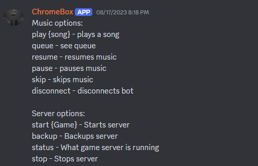
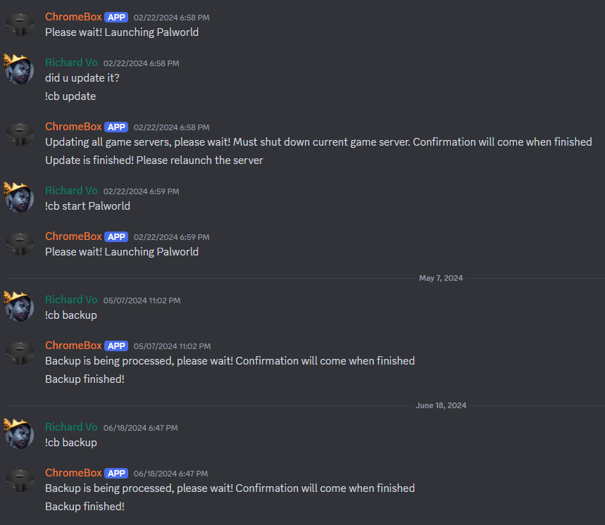
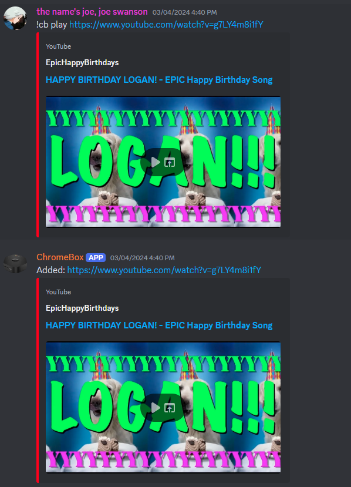

# Discord bot
The bot allows users to manage the server. 
This includes switching what game server is running, running various scripts on the server, and playing music in voice chat.

# How to run this
The script assumes some game servers are on the computer. These can be swapped out for whatever servers you want to run. You'll have to edit main.js and substitute the lines where Minecraft and Palworld are.
* Add discord api token in config.json
* run 'npm install'
* run 'node main.js'

# Screenshots

# Built With
* NodeJS

# Authors
* Richard Vo
